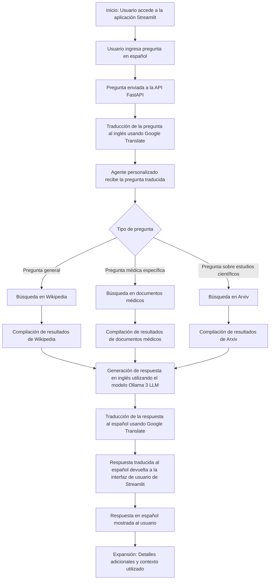

# Chatbot con FastAPI, Streamlit y LangChain (Versiones V1 y V2)

Este repositorio contiene dos versiones coexistentes de un chatbot desarrollado utilizando FastAPI, Streamlit y LangChain. Ambas versiones utilizan modelos de lenguaje de `ChatGroq`.

*   **Version 1 (Principal/Avanzada)**: Ofrece una funcionalidad completa con múltiples fuentes de datos (Elasticsearch, DisGeNET, PDFs vía RAG con `HuggingFaceEmbeddings`, ClinVar API) y un agente con diversas herramientas.
*   **Version 2 (Variante/Simplificada)**: Se enfoca en RAG a partir de documentos locales (PDF, CSV, JSON) utilizando `OllamaEmbeddings` y un agente más simple.

Para una explicación detallada de las arquitecturas y diferencias, consulta el archivo `API_VERSIONS_EXPLAINED.md`.

<!--
    La imagen de arquitectura actual podría necesitar una revisión o ser reemplazada para reflejar ambas versiones.
    
-->

## Requisitos Previos
- Python 3.8 o superior (actualizado para compatibilidad con dependencias recientes de Langchain)
- Redis (opcional, para caché en las aplicaciones Streamlit)
- Ollama (para la Version 2, si se usan `OllamaEmbeddings` localmente)
- Elasticsearch (para la Version 1)

## Instalación

1.  **Clonar el repositorio:**
    ```bash
    git clone https://github.com/tu-usuario/nombre-del-repositorio.git # Reemplaza con tu URL de repo
    cd nombre-del-repositorio
    ```

2.  **Crear un entorno virtual e instalar dependencias:**
    ```bash
    python -m venv venv
    source venv/bin/activate  # En Windows: venv\Scripts\activate
    pip install -r requirements.txt
    # Nota: Asegúrate que requirements.txt esté actualizado e incluya:
    # fastapi uvicorn streamlit langchain langchain_community langchain_groq langchain_elasticsearch googletrans beautifulsoup4 elasticsearch aiocache ollama huggingface_hub faiss-cpu sentence-transformers python-dotenv aioredis
    ```
    (Si `requirements.txt` no está en la raíz, ajusta la ruta, por ejemplo `requirements/requirements.txt` si es el caso).

## Configuración de Variables de Entorno

Crea un archivo `.env` en el directorio raíz del proyecto y añade las siguientes variables según sea necesario:

### Comunes para Ambas Versiones
*   `GROQ_API_KEY`: Tu clave API de Groq (requerida).
*   `HUGGING_FACE_API_TOKEN`: Tu token de Hugging Face API (usado por V1 para `HuggingFaceEmbeddings`).
*   `STREAMLIT_REDIS_URL`: URL de tu instancia Redis para la caché de las apps Streamlit (ej. `redis://localhost:6379`). Ambas apps Streamlit pueden usar esta variable y gestionarán namespaces de caché distintos (`main_cache` y `streamlit_variant_cache`).

### Específicas para Version 1 (Principal/Avanzada - `api/main.py`)
*   `GROQ_GENERAL_MODEL_NAME`: (Opcional) Modelo Groq para tareas generales (defecto: `mixtral-8x7b-32768`).
*   `GROQ_MEDICAL_MODEL_NAME`: (Opcional) Modelo Groq para tareas médicas (defecto: `mixtral-8x7b-32768`).
*   `PDF_DIRECTORY_PATH`: Ruta al directorio con PDFs para el RAG de V1 (ej. `./data/main_app_pdfs/`).
*   `ELASTICSEARCH_ENDPOINT`: Endpoint de Elasticsearch (ej. `tu-endpoint.es.cloud.region.amazonaws.com`).
*   `ELASTICSEARCH_USERNAME`: Usuario de Elasticsearch.
*   `ELASTICSEARCH_PASSWORD`: Contraseña de Elasticsearch.
*   `MAIN_API_URL`: (Opcional, para Streamlit V1) URL del backend V1 (defecto: `http://localhost:8000/ask`).

### Específicas para Version 2 (Variante/Simplificada - `api/main_variant_ollama.py`)
*   `OLLAMA_BASE_URL`: (Opcional) URL base si tu instancia Ollama no corre en `http://localhost:11434`.
*   `VARIANT_PDF_PATH`: (Opcional) Ruta al directorio de PDFs para el RAG de V2 (defecto: `./data/variant_docs/pdf/`).
*   `VARIANT_CSV_PATH`: (Opcional) Ruta al archivo CSV para el RAG de V2 (defecto: `./data/variant_docs/docs.csv`).
*   `VARIANT_JSON_PATH`: (Opcional) Ruta al archivo JSON para el RAG de V2 (defecto: `./data/variant_docs/docs.json`).
*   `VARIANT_API_URL`: (Opcional, para Streamlit V2) URL del backend V2 (defecto: `http://localhost:8001/ask`).

## Caché

Ambas aplicaciones FastAPI (`main.py` y `main_variant_ollama.py`) utilizan `aiocache` para caché en memoria por defecto para ciertas operaciones.
Las aplicaciones Streamlit (`streamlit_app.py` y `streamlit_variant_app.py`) pueden usar Redis para una caché más persistente y compartida si `STREAMLIT_REDIS_URL` está configurado. Cada app Streamlit usa un namespace de caché diferente para evitar colisiones.

## Uso y Ejecución

Asegúrate que los servicios externos necesarios (Elasticsearch para V1, Ollama para V2) estén en ejecución.

### Ejecutar Version 1 (Principal/Avanzada)

1.  **Iniciar Backend V1 (`api/main.py`):**
    ```bash
    uvicorn api.main:app --host 0.0.0.0 --port 8000 --reload
    ```
2.  **Iniciar Frontend V1 (`api/streamlit_app.py`):**
    (En una nueva terminal)
    ```bash
    streamlit run api/streamlit_app.py
    ```

### Ejecutar Version 2 (Variante/Simplificada)

1.  **Iniciar Backend V2 (`api/main_variant_ollama.py`):**
    ```bash
    uvicorn api.main_variant_ollama:app --host 0.0.0.0 --port 8001 --reload
    ```
2.  **Iniciar Frontend V2 (`api/streamlit_variant_app.py`):**
    (En una nueva terminal)
    ```bash
    streamlit run api/streamlit_variant_app.py
    ```

## Configuración de Datos

*   **Version 1 (`main.py`):**
    *   Coloca los documentos PDF en el directorio especificado por `PDF_DIRECTORY_PATH`.
    *   Asegúrate que Elasticsearch esté poblado con datos en el índice `genetic_information` si la funcionalidad "avanzada" que lo requiere será utilizada.
*   **Version 2 (`main_variant_ollama.py`):**
    *   Coloca los documentos PDF en el directorio `VARIANT_PDF_PATH`.
    *   Coloca el archivo CSV en `VARIANT_CSV_PATH`.
    *   Coloca el archivo JSON en `VARIANT_JSON_PATH`.

## Diagrama de Flujo del Proceso

<!--
El diagrama de flujo actual necesita una revisión exhaustiva para representar adecuadamente
las arquitecturas de AMBAS versiones V1 y V2, o ser reemplazado por diagramas individuales
o una referencia a API_VERSIONS_EXPLAINED.md.


-->
Para un entendimiento detallado del flujo y la arquitectura de cada versión, por favor consulta `API_VERSIONS_EXPLAINED.md`.


## Contacto y Soporte
Si tienes alguna pregunta o encuentras algún problema, no dudes en abrir un *issue* en este repositorio.

¡Disfruta usando los chatbots!
